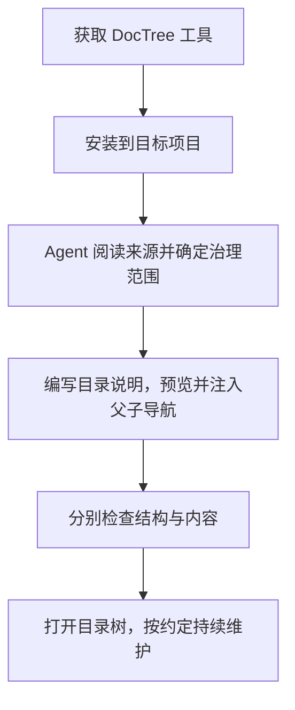

<!-- doctree:node {"schema":2,"id":"doctree","title":"DocTree 工具"} -->
<!-- doctree:purpose:start -->
> 本目录职责：维护人和 Agent 共用的目录协议、轻量查看器、显式文档核对与通用教学样例。
<!-- doctree:purpose:end -->
<!-- doctree:nav:start -->
> 上级：无（项目入口）
> 子目录：[协议与指南](docs/README.md) · [工具实现](doctree/README.md) · [回归验证](tests/README.md) · [人类目录视图](web/README.md)
> 更新约定：先更新本目录；影响范围、结论或下一步时核对上级 README。执行完成与业务/科学验收分别记录。
<!-- doctree:nav:end -->

# DocTree · 给 Agent 和人类共用的目录说明

DocTree 将目录职责、父子导航和更新约定保存在项目自己的 Markdown 中。Agent 直接沿文件阅读，人类通过可折叠的目录树浏览同一份内容；文件保持原位，治理范围由用户按实际用途选择。

当前版本 **0.4.0**：文件树作为默认首页，支持展开层数、搜索、缩放和目录说明阅读。需要证据、交接与审阅历史时，可进入详细治理页。变更见 [版本说明](CHANGELOG.md)，格式见 [Markdown 节点协议 v2](docs/MARKDOWN_PROTOCOL_V2.md)。

## 首次接入：先装工具，再让 Agent 整理项目

安装和建立管理内容是两个阶段。完整步骤见 [首次安装指南](docs/GETTING_STARTED.md)，可执行的 Agent 指令见 [首次接入指令](docs/AGENT_ONBOARDING.md)。



**1. 获取工具。** 需要 Git 和 Python 3.10+。在工具存放目录执行；私有仓库需有访问权限。

```powershell
git clone https://github.com/AnandaFana/AI_doctree.git
cd AI_doctree
```

**2. 安装到已有项目。** 将 `..\my-project` 换成实际目标路径。以下从工具仓库根目录执行，再进入目标项目：

```powershell
python -X utf8 -m doctree.portable --root "..\my-project" install
cd "..\my-project"
```

轻量接入只用 Python 标准库，无需安装 PyYAML、Node、数据库或模型服务。此时只部署了工具及 AGENTS / `.gitignore` 指引，**不会自动建立业务 README 或理解项目内容**。

**3. 让 Agent 首次整理。** 在目标项目中打开 Agent，发送：

```text
请执行 .doctree/ONBOARDING.md 的首次接入流程，为当前项目建立 DocTree 目录说明。
先阅读实际来源和目录统计，沿用已确定的治理范围；未确定时向我建议并确认范围。
请填写有依据的职责与必要正文，预览并注入节点和父子导航，保留原文与历史。
不要停在安装工具或生成空模板。最后分别报告结构、内容核对结果及未覆盖范围。
不要修改业务源码、运行项目实验，或自动提交、推送目标项目。
```

范围可以是“根及直接子目录，深度 1”，也可以是“根、src、docs”。用户可以明确授权 Agent 按用途选择范围。完整指令随安装复制到 `.doctree/ONBOARDING.md`，目标项目不需要依赖原工具目录来阅读它。

**4. 检查接入结果。** Agent 应核对所选范围的节点、实际职责、入口链接和未解决项；`sync --check` 只证明现有导航无差异，不能代替内容核对。空项目也可能返回无差异，不能据此宣布整理完成。

**5. 打开页面。** 在目标项目根目录执行：

```powershell
python -X utf8 .doctree/manage.py serve
```

打开 [便携目录树](http://127.0.0.1:8768/)。`serve` 持续占用终端；其他命令在另一个终端执行，停止时按 `Ctrl+C`。端口冲突可加 `--port 8769`。

```text
my-project/
├── README.md           共享：职责、父子导航、更新约定与原有正文
├── src/
│   └── README.md       在选定范围内由 Agent 按来源建立的说明
├── AGENTS.md           共享：阅读和更新指引，保留原有约定
├── doctree-policy.json 按深度治理时保存的共享范围
├── .gitignore          忽略本地 .doctree/ 管理目录
└── .doctree/
    ├── manage.py       便携命令入口
    ├── ONBOARDING.md   完整的 Agent 首次接入流程及流程图
    ├── AGENT_GUIDE.md  日常操作说明
    ├── lib/           Python 标准库实现
    ├── web/           树图页面
    └── backups/       写入前原文与恢复记录
```

安装器只维护自己声明的工具文件和 AGENTS / `.gitignore` 的标记区块。共享知识保存在项目 Markdown 中，克隆项目后重新安装工具即可；已经接入的节点无需重做。**Git 忽略不意味着可以随意删除**：已有治理历史 `state.json` 和原文备份不能靠扫描重建，需要另行保留。

## 选择 README 的治理深度

先在目标项目根目录查看分布，再选择合适范围：

```powershell
# 只读摘要：各层目录数量、已有说明和待补充情况
python -X utf8 .doctree/manage.py coverage --summary

# 检查根目录及直接子目录；未覆盖时返回非零退出码
python -X utf8 .doctree/manage.py coverage --depth 1 --check

# 预览接入差异，不写文件
python -X utf8 .doctree/manage.py cover --depth 1

# 确认范围和差异后应用，保留原文与备份
python -X utf8 .doctree/manage.py cover --depth 1 --apply
```

根目录为第 0 层。Agent 可以根据目录数量和用途建议深度；用户已经明确范围时直接按范围执行，范围不明确时再讨论。缓存、批次和历史产物不应一律要求逐个建立 README。需要完整范围时显式使用 `--all`；未指定范围的 `cover` 会拒绝批量接入。

可将 [范围配置示例](config/coverage-policy.example.json) 放在目标项目的共享位置，通过 `coverage --policy 文件.json` / `cover --policy 文件.json` 复用。已有 README 正文和自定义节点文档会保留。新增模板只记录可核对的位置与约定，实际职责和结论仍由人或 Agent 阅读来源后维护。

## 日常阅读和同步

从目标项目根目录运行：

```powershell
python -X utf8 .doctree/manage.py context --directory .
python -X utf8 .doctree/manage.py sync --check
python -X utf8 .doctree/manage.py sync

# 逐个接入：--check 预览，去掉 --check 应用
python -X utf8 .doctree/manage.py annotate --directory . --purpose "项目目标、职责与下级入口" --check
```

`sync --check` 有待写入差异时退出码为 1；`sync` 应用已有节点的父子导航，不批量创建普通目录的 README。批量接入可用便携 `sync --selections 文件.json --check` 预览，去掉 `--check` 应用。选择项可为新文档提供实际 `initial_body`，已有文档不提供该字段；首次应用后日常使用不带选择文件的 `sync`。完整步骤见 [Agent 首次接入指令](docs/AGENT_ONBOARDING.md)。

Agent 先读根 README，再沿链接阅读工作目录；完成工作后更新本目录，影响上级范围、结论或下一步时再核对父节点。工具负责结构和链接，`sync` 不自动总结正文、不判断业务或科学验收。可选的 Git 维护检查会提示待核对目录，并记录 Agent 或人的核对理由；没有持续文件监听或模型自动摘要。

## 可选：收尾时发现可能漏更的说明

在有提交历史、已接入节点的目标项目根目录运行：

```powershell
python -X utf8 .doctree/manage.py review init
python -X utf8 .doctree/manage.py review check
```

第一次建立 Git 比较基线，之后在收尾时执行 `review check`。已提交和未提交的变化会归属到最近的目录节点；树图加载或刷新时也会提示“待核对说明”。未启用的项目维持原有导航方式。

Agent 阅读实际差异后，更新说明，或记录“无需更新”及理由，再用当前 token 确认。只有明确需要时才提示直接父节点，逐级判断，在不影响上层时结束。共享记录只有一个 `doctree-review.json`，工具不自动改写正文，也不把这项声明当成业务验收。具体命令、读取边界和流程图见 [轻量维护说明](docs/MAINTENANCE.md)。

`context --directory 路径` 现在直接定位目标，不受网页的批次折叠或 350 节点限制。默认只返回目标正文、祖先职责和孩子入口，最多 24000 个输出字符、20 个孩子；需要更多正文时显式使用 `--body-scope all`，或对某个孩子单独调用 context。截断会明确标记。

## 可选：教学样例与详细治理页

若想先体验随仓库提供的教学项目（含五节点 v2 样例），或查看证据、交接与审阅历史，在 **DocTree 工具仓库根目录**运行：

```powershell
python -m pip install -r requirements.txt
python -X utf8 -m doctree serve
```

打开 [样例目录树](http://127.0.0.1:8765/) 或 [详细治理页](http://127.0.0.1:8765/details)。Windows 也可使用 `.\start.ps1` / `.\stop.ps1`，启动和停止都支持 `-Port 8766`。该服务需要 PyYAML；目标项目的轻量工具不需要这个可选步骤。

目录树支持展开 1/2/3 层、搜索、平移和缩放；详细页右上方及左侧都有返回入口。页面展开层数只影响显示，不会创建 README。

## 本地项目与 Git 分开

[config/projects.json](config/projects.json) 只包含可分享的教学样例。需要管理自己的项目时，将它复制为 `config/projects.local.json`，在本地副本中配置项目入口。启动时优先读取本地配置；显式 `--config` 优先级最高，例如：

```powershell
python -X utf8 -m doctree --config config/projects.json --state-dir .doctree/sample-view serve --port 8766
```

项目路径相对于配置目录的上一级，也可使用本机绝对路径。使用另一份配置时配合独立的 `--state-dir`，避免混用治理历史。

`local-projects/` 用于存放不提交的自有项目副本；`config/*.local.json`、`.doctree/`、`artifacts/` 和本地试点材料均被忽略。若将自有项目放在其他目录，**复制前先将该目录加入 `.gitignore`**。忽略规则不会撤回已进入 Git 历史的内容；发布前检查本轮提交和历史，方法见 [发布约定](docs/PUBLISHING.md)。

## 开发与验证

```powershell
python -X utf8 -m unittest discover -s tests -v
python -X utf8 scripts/demo_workflow.py
python -X utf8 scripts/demo_v2_workflow.py
```

演示脚本默认在临时副本中回放教学交接，不覆盖当前界面的历史。实现入口包括 [Markdown 注入](doctree/markdown_protocol.py)、[目录树与上下文](doctree/foldertree.py)、[治理范围](doctree/coverage.py)、[便携安装](doctree/portable.py)。

[维护闭环](docs/MAINTENANCE.md) · [当前协议](docs/MARKDOWN_PROTOCOL_V2.md) · [v1 详细治理协议](docs/PROTOCOL.md) · [方法演进记录](docs/METHODOLOGY.md) · [版本说明](CHANGELOG.md)
