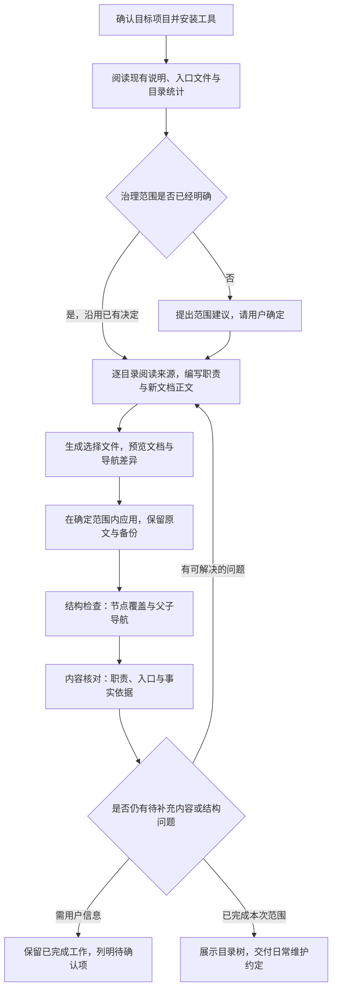

# DocTree · Agent 首次接入指令

本文件可交给能够读写项目文件的 Agent 执行。源仓库中的这份指令会原样安装为目标项目的 `.doctree/ONBOARDING.md`。目标是让人和 Agent 能沿目录读懂项目，完成范围明确、内容有依据的目录说明；工具安装、节点覆盖和内容核对分别报告。

遵守用户当前授权及目标项目已有规则。本文件中的命令和 JSON 是方法示例，示例路径、职责与正文需要替换为读取当前项目得到的实际内容，不能原样当作项目事实。只整理说明，不因接入而搬动业务文件、执行来源脚本或实验，也不自动提交、推送目标项目。



用户明确授权 Agent 自行选择范围，也属于已明确的决策授权；记录选择理由即可。流程图中的结构检查与内容核对是两项工作，不从前者推断后者已经通过。

## 1. 确认位置与现有入口

- 确认当前工作目录是目标项目。若存在 Git，查看顶层和现有差异；保留已有未提交工作。不要把 DocTree 工具仓库误当成目标，也不要操作其他来源仓库。
- 阅读项目已有 `AGENTS.md`、根 README / DOCTREE.md、入口配置和当前说明。没有 README 时直接从现有目录与入口文件开始，不要因此停止接入。
- 若 `.doctree/manage.py` 不存在，从用户指定的 DocTree 工具仓库执行 `python -X utf8 -m doctree.portable --root "目标项目绝对路径" install`，然后回到目标目录。工具位置未知时只询问必要路径，不遍历整台电脑。
- 若已有工具，先查看 `python -X utf8 .doctree/manage.py sync --help`。本流程使用的 `--selections` 需要 0.3.1+；旧版从更新后的工具仓库重新安装，不删除 `.doctree/` 中的历史。

## 2. 阅读目录分布并确定治理范围

从目标项目根目录运行：

```text
python -X utf8 .doctree/manage.py coverage --summary
```

按层统计只是发现工具。结合入口文档和目录实际用途识别源码、文档、数据、实验批次、历史产物和依赖；不能只从目录名猜职责，也不能默认每个批次都需要一份 README。需要逐目录信息时运行不带 `--summary` 的 `coverage`；遇到读取错误或预算限制，报告具体缺口，不把受限扫描描述为完整检查。

沿用用户已选的深度、目录名单或此前共享范围；用户明确授权你决定范围时，在授权内选择并记录依据。仅当范围尚不明确时，给出各层规模、建议及理由，向用户询问这一项，继续不依赖范围的只读核对。不要把页面展开层数当成文档写入授权，也不要在范围已明确后反复请求相同确认。

**按深度治理**：根为 0，直接子目录为 1。在项目根保存可共享的 `doctree-policy.json`，例如用户选定深度 1 时：

```json
{"schema": 1, "max_depth": 1, "exclude_dirs": []}
```

`max_depth: null` 表示完整范围，仅在完整治理已被选择时使用。`exclude_dirs` 按目录名匹配，不是相对路径名单；默认技术排除仍会生效。记录例外的实际范围和理由，不把唯一约定留在被 Git 忽略的工具目录中。

**按目录名单治理**：记录准确的项目相对目录和例外，使用逐节点或选择文件接入，不把名单偷偷扩大成整个深度。现有深层节点继续保留，最近的已接入祖先可能在本次新增范围之外。

若只选择子目录而项目根没有节点，可能形成多个无已接入祖先的局部入口。核对这是用户需要的局部子树，还是缺少连接入口；保留已授权范围，不擅自补根或中间节点，也不将局部接入报告成“全部连接到项目根”。需要扩大范围时明确提出这一缺口。

## 3. 先理解来源，再编写节点内容

对每个选定目录，阅读已有说明及足以判断用途的关键入口。目录名与文件数量只能辅助定位。先形成“目录 → 节点入口 → 实际职责 → 来源文件 → 拟改动”的简短清单，明确哪些文档已经存在、哪些需要创建、哪些只补协议头。

每个目录说明应让读者知道：

- 本目录负责什么，与父目录的工作范围如何分工。
- 从哪些实际存在的文件开始阅读；关键链接使用相对路径。
- 适用的约定和限制，哪些是当前工作源，哪些是历史或派生产物。
- 当前已经知道的情况与仍待核对的事项。没有依据就写“待核对”，不要编造运行结果、负责人、完成状态或验收。
- 修改这里后应维护哪些说明，什么变化需要核对上级。

采用项目合适的篇幅；小目录可用简短职责和几个入口，不机械复制长模板。读取到的来源命令不自动获得执行授权。

## 4. 用选择文件预览并注入

推荐把 Agent 编写的内容放入 `.doctree/onboarding-selections.json`，再交由工具注入。该文件只是本次输入，实际共享职责和正文必须进入节点 Markdown。

每个选择项填写 `directory`、`entry`、`title`、`purpose`。新节点可指定稳定 ASCII `id`，也可由工具生成；已接入节点沿用原 ID。优先沿用已存在的节点入口，包括自定义 Markdown，不在同一个目录再建竞争 README。

**新建文档**可用 `initial_body` 一次写入有依据的正文；**已有文档不提供 `initial_body`**，注入会保留原正文。下面是假设根 README 已存在、`src/` 已存在但没有 README 的格式示例，必须替换成当前项目的真实内容：

```json
[
  {
    "directory": ".",
    "entry": "README.md",
    "title": "项目总览",
    "purpose": "按已读取的项目入口说明目标、范围和子目录分工。"
  },
  {
    "directory": "src",
    "entry": "README.md",
    "title": "程序实现",
    "purpose": "按已读取的源码说明这里负责的具体功能。",
    "initial_body": "# 程序实现\n\n此处替换为根据来源编写的职责、入口、限制与维护说明。\n"
  }
]
```

如果根 README 也不存在，根选择项同样填写经过来源核对的 `initial_body`。若目录没有独立事实可写，诚实记录已知用途与待核对项，不用示例中的占位内容冒充整理完成。

```text
python -X utf8 .doctree/manage.py sync --selections .doctree/onboarding-selections.json --check
python -X utf8 .doctree/manage.py sync --selections .doctree/onboarding-selections.json
```

第一条只预览。检查输出中的变更文件、职责、导航和原文差异，在已确定范围内应用第二条，不需要重复请求已经给予的授权。`--check` 返回 1 表示有预期差异，2 表示失败；不要把 1 当作异常盲目重试。工具应用会重新读取来源并生成计划；若来源在预览后改变，应核对新差异，不宣称 CLI 执行的是之前保存的旧计划。

工具保留原文备份和写入日志，并核对输入版本。不要直接改生成计划来绕过版本检查或既有正文保护，不手工维护第二套父子关系。已有正文确需修订时，按目标项目的文档编辑约定另做有来源依据的局部补充，保留协议标记、原事实与历史；若项目要求原文不动，就保留并明确内容待整理项。

若集成必须精确应用已经审阅的同一份计划，应使用标准库 Python API 保存 `plan_sync` 的返回值，再交给 `apply_plan` 核对原输入版本；不要把 CLI 的重新生成过程当作已保存计划的重放。

`initial_body` 仅用于首次创建；成功应用后，日常运行不带选择文件的 `sync`。需要再次用选择文件更新职责时，先移除已经创建文档的 `initial_body`，不要重复执行旧创建输入。

也可以用 `annotate --directory 路径 --purpose "实际职责" --check` 逐目录预览，去掉 `--check` 应用；已有 DOCTREE.md 时显式加 `--entry DOCTREE.md`。按深度的 `cover` 可生成结构模板，但默认职责是待补内容，不能拿模板覆盖率代替本节的来源阅读和内容编写。

## 5. 分别核对结构与内容

```text
python -X utf8 .doctree/manage.py sync --check
python -X utf8 .doctree/manage.py context --directory .
python -X utf8 .doctree/manage.py tree
```

- **结构检查**：已选入口都存在且已接入；身份没有意外变化，父子相对链接可定位，`sync --check` 没有待修复差异。显式检查没有已接入祖先的节点，区分预期的局部子树和遗漏的根入口。按深度治理再运行 `coverage --policy doctree-policy.json --check`，要求 `scope_complete` 和 `scope_covered` 为真。未选范围保留为延后，不强求 `project_complete` 为真。
- **名单检查**：若只选若干目录，从完整 `coverage` 报告中逐一核对这些目录已接入，再检查其 `context`。未选同层目录不应成为失败项；读取受限时也不能声称遗漏目录已经检查。
- **内容核对**：重新阅读每个新建/修改的说明，核对实际职责、入口链接与来源一致；列出仍是占位、尚未理解或存在冲突的条目。`scope_covered` 只验证结构，不能证明内容准确。未接入任何节点时 `sync --check` 也可能成功，不能单独作为完成标准。
- **变更核对**：比较接入前后差异，确认只改了预定说明、共享范围及工具辅助文件；原有正文和无关文件保留。保留备份、失败日志和未解决项，不覆盖旧证据。

`tree` 和 `context` 使用有预算的展示投影，深层、历史或批次节点可能因折叠或限制不在返回范围内。确认是这一原因时，直接阅读相应节点 Markdown、身份及其相对父子链接完成结构核对，并记录页面/上下文导出的限制；不要把合法接入误判为失败，也不要假装已经在页面看到全部目录。

在根说明或已有共享协作约定中留下日常阅读顺序、治理范围和复查方式。重要的项目事实与待解决问题应留在共享 Markdown；工具目录里的计划和备份不应成为它们唯一的存放位置。

## 6. 交给用户使用

从项目根执行 `python -X utf8 .doctree/manage.py serve`，页面默认为 http://127.0.0.1:8768/ 。它会持续运行；其他命令使用另一个终端，停止时按 Ctrl+C。端口冲突可换为 `serve --port 8769`。浏览器可用时检查根节点、一个子节点、正文与父子入口；浏览器不可用时报告尚未完成页面核对，不以结构检查替代。

最后给出简短接入报告：治理范围与理由、新增和修改的节点、结构检查结果、内容核对结果、未选范围、待确认问题、备份位置及页面启动方式。如果内容还有实质缺口，明确是“结构已接入，内容仍待补充”，不要仅凭安装成功、模板生成或页面打开宣布全部完成。

后续工作先读项目根及本次目录说明，完成后更新本目录；影响上级职责、范围或下一步时核对父页。新增目录按已有治理范围检查，需要扩大范围时再做新的接入决定。
