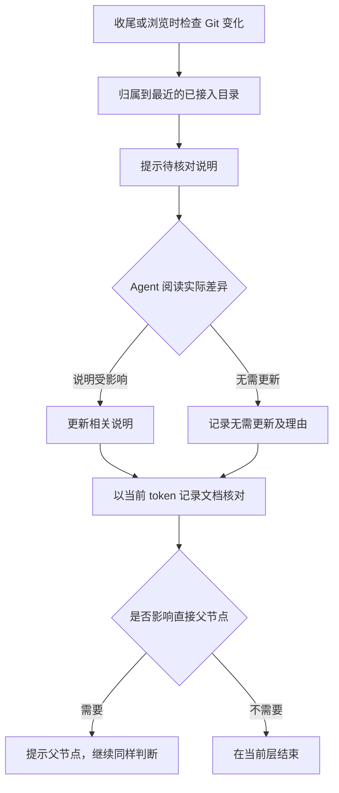

# 轻量的文档核对

这个可选功能回答“代码或文件变化后，相关说明是否有人核对过”。它使用 Git diff 和一个共享的 `doctree-review.json`，没有后台监听、模型调用、自动摘要或任务队列。来源内容不复制进记录；职责、正文和是否需要更新上级，交给人或 Agent 判断。



## 开始使用

先完成 Markdown 节点接入，再在**有提交历史的 Git 项目根目录**启用：

```text
python -X utf8 .doctree/manage.py review init
python -X utf8 .doctree/manage.py review check
```

`init` 只记录当前 HEAD 为比较起点，不声称更早的工作已核对；重复 init 保留原起点和记录。需要检查已有一段改动时，在首次 init 使用明确的 `--base 提交号`。基线提交应随仓库历史保留，浅克隆缺少它时需补齐历史后检查。

`check` 比较基线到当前工作区的 Git 变化，同时纳入未忽略的新文件，覆盖已提交、暂存、未暂存、新增和删除。变化按当前目录结构归到最近的节点；没有已接入祖先的变化单独列出，不能冒充全部已治理。被 Git 忽略的未跟踪文件不在这个检查范围内。显式 `review check --check` 在有待核对或未归属变化时返回 1，失败或未初始化返回 2。

检查范围内的跟踪文件若带有 `assume-unchanged` 或 `skip-worktree` 索引标志，工具会明确报告检查未完成，因为这些标志可能隐藏工作区变化；由用户人工确认处理，工具不清除标志或补做全量来源扫描。

没有 Git、没有提交历史或只管理外层仓库里的一个普通子目录时，本功能会说明不可用，不自动初始化 Git。README 导航和目录树仍可使用。

## 由 Agent 完成一次核对

先读 `check` 输出中节点的变化路径、`token` 和直接子节点请求，再阅读实际差异。`updated` / `no_change` 是明确的文档核对声明，不是工具对说明质量的证明。

需要改说明时，遵循项目文档约定更新真实职责和相关正文，再重新执行 check 获取更新后的 token。无需改说明时，也须写明原因。例如内部重构没有改变职责、入口、使用方法或对外行为。

```text
python -X utf8 .doctree/manage.py review ack --node 节点ID --token 当前token --decision no_change --reason "内部重构，说明中的职责与入口仍准确" --reviewer "Agent或人的标识" --parent-impact not_needed --parent-reason "父目录的职责、入口与下一步未变化"
```

如果已经更新说明，使用 `--decision updated` 并写明核对理由。若需要上级吸收变化，使用 `--parent-impact needed` 和具体理由。工具只提示直接父节点，不自动改父 README，也不让所有祖先同时进入工作队列。父节点的确认记录会保存其已吸收的子 token，然后再次判断是否还需要向上。

旧 token 会拒绝提交，需重新阅读变化；相同记录重复提交不制造新记录。共享文件只保留每个节点最近一次声明，原文件在 `.doctree/backups/maintenance/` 留备份，正常 Git 提交记录其版本历史。不要把 `doctree-review.json` 当缓存删除，也不要用重新设置基线清除未核对工作。

## 页面与边界

已启用的项目在树图加载或刷新时检查变化，节点会显示“待核对说明”；点击节点可看到说明状态。没有启用时不增加检查。页面不提供一键自动验收，Agent 仍通过命令和理由完成核对。

记录针对文档维护，不能替代业务测试、科研验收、审阅身份认证或访问控制。任何有写权限的人都能编辑共享 JSON，`reviewer` 是自述标识，没有数字签名。代码改变后无需修改说明也是合理结果，前提是明确核对并留下理由。

为了保持可预期的成本，每次最多处理 4000 个 Git 可见文件、单份读取 1 MB、总读取 16 MB，Git 命令限时 20 秒。超过预算或读取失败时明确检查未完成，不静默显示“全部有效”。对于大型二进制仓库或大量归档，先使用重要子项目的独立 Git 仓库试点；不要为了通过检查随意改动历史或扩大排除范围。

基线固定意味着 diff 可能随时间增长。当前版本不自动滚动基线、不自动归档，不追踪 Git 忽略的业务文件；长期大仓库工作流留给后续真实反馈再决定。

## 自身与短期试点

DocTree 自身的根、实现、文档、网页和测试已经有 v2 说明；在工具仓库运行 `python -X utf8 scripts/sync_self.py --check` 检查导航，`--apply` 应用。此专用命令明确隔离本地试点与产物目录。示例 `examples/v2/` 展示五个节点；`scripts/demo_v2_workflow.py` 在临时 Git 副本里演练故意漏更、确认无需更新、父级按需吸收与旧 token 拒绝。

下一步可在用户选定项目的一条小工作线试用一周，记录每次寻找上下文用时、收尾维护用时，以及一次有意漏更能否被暴露。无需采集项目正文，只记录次数、耗时和判断理由。试点的项目路径、工作分支和治理范围由用户确定；这份计划不会自动进入其他项目或建立定时任务。
